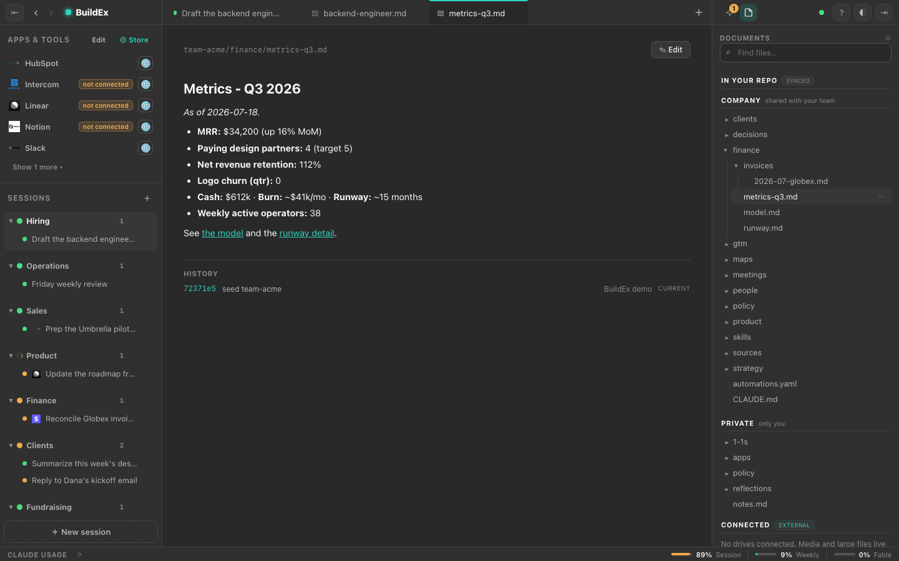
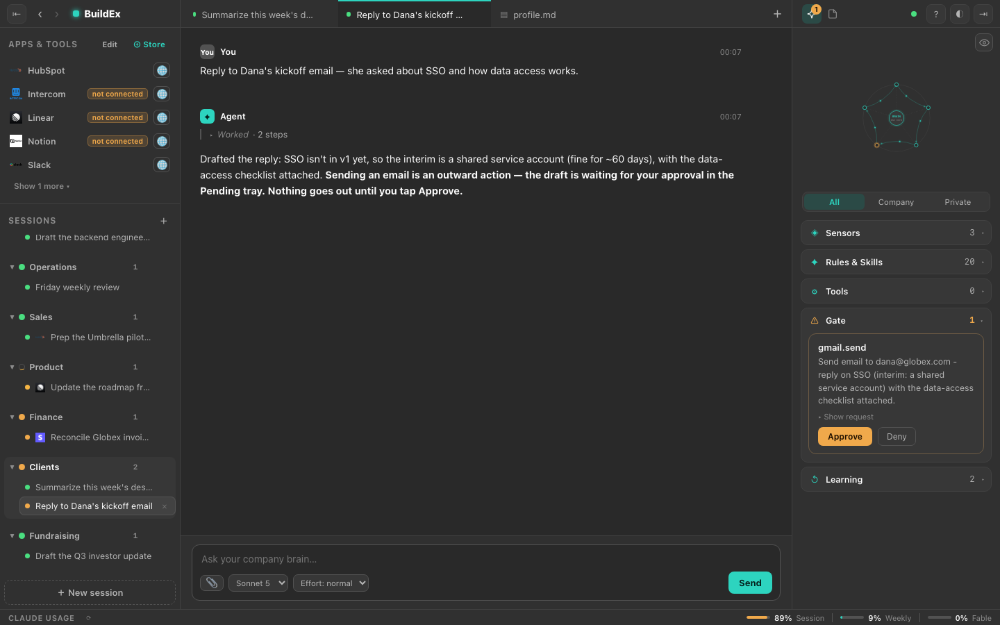
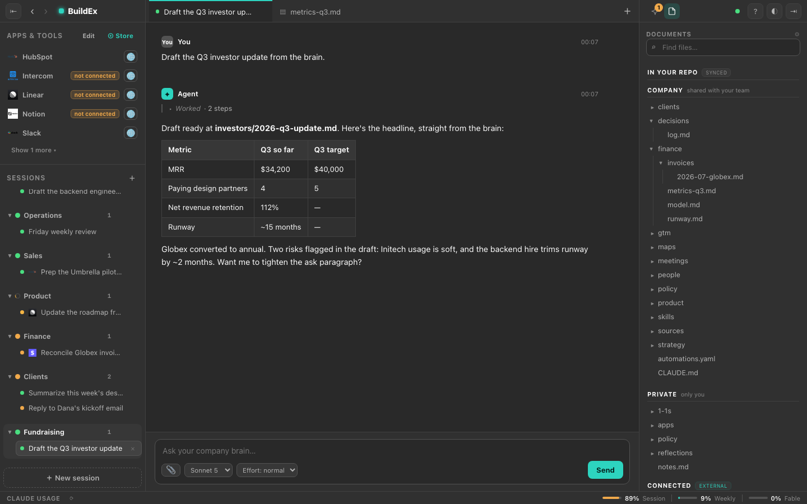
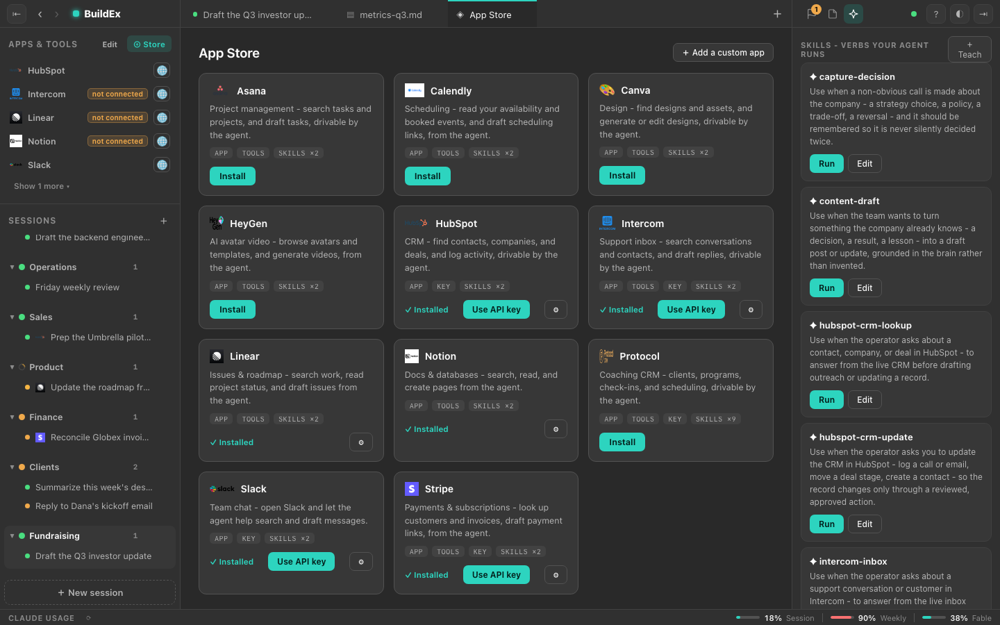
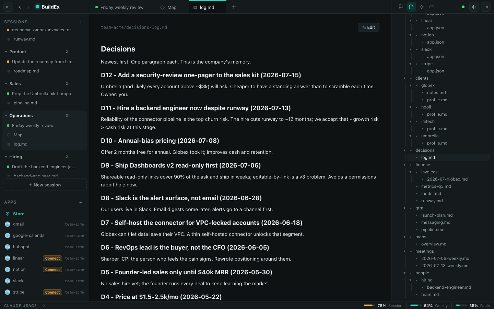

# BuildEx

**Run your company on a coding agent, git, and your own tools — on your machine.**

BuildEx gives your company one git-backed brain of plain markdown that holds everything it knows —
strategy, clients, finance, decisions, connector data — and puts your own AI agent to work on it
directly, on your machine. The cloud only syncs. Anything outward or irreversible waits for a human
tap. It's the app of [buildexponential.org](https://buildexponential.org).



> **Status: pre-alpha, building in the open.** BuildEx runs on macOS as a signed one-click download —
> grab the DMG from [buildexponential.org](https://buildexponential.org/download), no terminal required.
> You can also run the whole product from source with the demo below. The fully self-serve onboarding
> for non-technical operators is still being polished.

---

## What it is

Most "AI for work" tools are a chat box in someone else's cloud. BuildEx is the opposite:

- **Your files stay on your machine.** The brain is plain markdown in git repos you control.
- **Your own agent does the work.** BuildEx drives *your* Claude Code login — it never sees your
  keys, never proxies a model, never resells tokens.
- **Git is the database.** Every change is a commit. Full history, full undo, nothing hidden.
- **You approve the big moves.** The agent works on its own by default — but sending an email,
  posting to Slack, spending money, anything you can't undo waits for your ok. One tap. Everything
  outward is logged.
- **The cloud only syncs.** It moves commits between your machines and teammates. It can't read your
  brain or your model traffic.

Built for the operator who runs the company — not the engineer. You can install the app in one click
today; the one-command demo below runs the same product from source. The fully self-serve onboarding
is still being polished — the vision is unchanged, and the on-ramp gets shorter with each release.

## Isn't this just Claude Code in a git repo?

Fair question — and yes, the shared part is real: your own `claude` CLI is the engine that does the
work. That's the point, not an accident. BuildEx is the seam around it that turns a coding agent into
something a company can safely run on. Each claim below points at the code and the test that enforces
it, so you can check rather than trust:

- **The approval gate fails closed.** Outward actions route through a hook that maps to a `deny`
  decision on *every* error path — daemon unreachable, malformed response, anything — so a bug can
  never silently let an action through. Enforced: [`apps/client/scripts/gate-hook.mjs`](apps/client/scripts/gate-hook.mjs) + [`apps/client/src/gate/`](apps/client/src/gate/); pinned by [`apps/client/src/gate/gate-hook.test.ts`](apps/client/src/gate/gate-hook.test.ts).
- **Five invariant suites are release gates that can't be skipped** — and a meta-test scans the whole
  monorepo and fails if the tagged set isn't *exactly* those five. Enforced: [`apps/client/src/invariants/invariants-registry.test.ts`](apps/client/src/invariants/invariants-registry.test.ts).
- **Your keys are never touched.** BuildEx drives your own signed-in agent and asserts it never sets
  a provider API key — the conductor bright-line. Enforced: [`apps/client/src/agent/claude-driver.ts`](apps/client/src/agent/claude-driver.ts); pinned by [`apps/client/src/agent/claude-driver.test.ts`](apps/client/src/agent/claude-driver.test.ts) (`ANTHROPIC_API_KEY` stays undefined).
- **Connector credentials live in your OS keychain, and filing is read-only by construction** — the
  gateway is default-deny, gating any tool that can't prove it's read-only. Enforced: [`apps/connectors/src/gateway.ts`](apps/connectors/src/gateway.ts).
- **Company isolation is enforced server-side** by a permission matrix, not by convention. Enforced:
  the permission-matrix invariant suite in [`apps/sync/src/sync-acceptance.test.ts`](apps/sync/src/sync-acceptance.test.ts).

## See it

A demo company — *Acme Labs*, a small B2B SaaS — running on BuildEx:

| | |
|---|---|
|  **Nothing outward happens without you.** The agent's outward actions wait in a Pending tray — approve or deny. |  **Ask your company brain.** "Draft the Q3 investor update" — it reads the metrics, writes the doc, and reports back. |
|  **Connect the tools you already use.** Gmail, Slack, Notion, Linear, Stripe, HubSpot — installed per company. |  **Every decision, remembered.** The brain is organized markdown; the agent keeps it tidy and never forgets. |

## Quickstart — run the demo

> Just want to use it? [Download the macOS app](https://buildexponential.org/download) — no terminal
> needed. The steps below run the same product from source, for contributors and the curious.

**Prerequisites**

- **macOS** (Linux and Windows are on the roadmap — the keychain path is macOS-only today)
- **Node 22+**
- **git**
- **[Claude Code](https://claude.com/claude-code)** signed in with **Claude Pro or higher** — BuildEx
  drives your own agent; it does not include or resell one.

**Run it**

```sh
git clone https://github.com/dejankeri/buildex.git
cd buildex
npm install
npm run demo          # opens the operator console in your browser
# or: npm run demo:app   # the native desktop app
```

`npm run demo` provisions a throwaway company (*Acme Labs*, seeded with a full brain, sessions,
and installed apps) and opens the console. Nothing leaves your machine; no account
needed. Poke around, open a session, edit a doc, watch the history. Reset anytime with
`npm run demo:setup -- --reset`.

Want the agent to actually run? Give it an isolated login once: `npm run demo:agent-login`. Without
it the console still reads and writes the brain fine.

For a guided walkthrough of what to click and what to look for, see [`DEMO.md`](DEMO.md).

## What works today (honestly)

| Works now | Not yet |
|---|---|
| The full operator console (sessions, brain, docs, history, map) | In-app auto-update (re-download the DMG to upgrade today) |
| One-click signed & notarized macOS download | — |
| Your own agent reading + editing the brain, gated at outward actions | Live Gmail/Slack/Notion out of the box (needs your own OAuth app — [guide](docs/guides/connect-a-connector.md)) |
| Git-as-database: every change a commit, full history + restore | Hosted sync & seats (local-first demo today) |
| The App Store: install capability packs per company | Linux & Windows (macOS-first at launch) |
| Skills: teach the agent your company's verbs | Fully self-serve, non-technical onboarding |

## Guides

- [Run the app](docs/guides/run-the-app.md)
- [Teach the agent a verb (a skill)](docs/guides/teach-a-verb.md)
- [Install a capability pack](docs/guides/install-a-pack.md)
- [Connect a connector (bring your own OAuth)](docs/guides/connect-a-connector.md)
- [How sync, backup, and never-lose-work behave](docs/guides/sync-and-backup.md)

---

## For contributors

BuildEx is MIT-licensed and built in the open. The platform is here; the roadmap is ours to steer.

**Repo layout**

| Path | What |
|---|---|
| `apps/client` | Electron desktop app + local daemon (the product) |
| `apps/sync` | the thin cloud service (identity, git hosting, seats) |
| `apps/connectors` | connector framework + catalog (runs inside the client) |
| `apps/site` | buildexponential.org (static) |
| `apps/toolkit` | provisioning / backfill / connector-scaffold library |
| `packs/core` | the content shipped into every company's `core` repo |
| `infra/` | infra templates + deploy tasks — structure only, no live values |
| `docs/` | guides ([`docs/guides/`](docs/guides/)) and reference notes |

**Develop**

Contributors also need **[go-task](https://taskfile.dev)** (`brew install go-task`) — it runs the CI
gate below. The demo above doesn't use it.

```sh
npm install        # hoists deps to root
task               # list tasks
task ci            # the full gate: secret-scan → test-collection-audit → typecheck → test
```

New to the repo (human or agent)? Read [`CLAUDE.md`](CLAUDE.md) first — it's the operating contract.

## Security & community

- **Found a vulnerability?** Report it privately — see [`SECURITY.md`](SECURITY.md). Please don't
  open a public issue for a security bug.
- **Contributing:** [`CONTRIBUTING.md`](CONTRIBUTING.md).
- **Be kind:** we follow the [Contributor Covenant](CODE_OF_CONDUCT.md).
- **Telemetry: none.** The app and daemon send no analytics, telemetry, or crash reports (v1).

## License

[MIT](LICENSE) over the whole monorepo.
