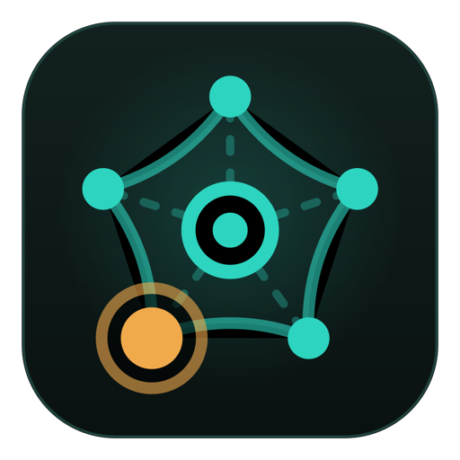
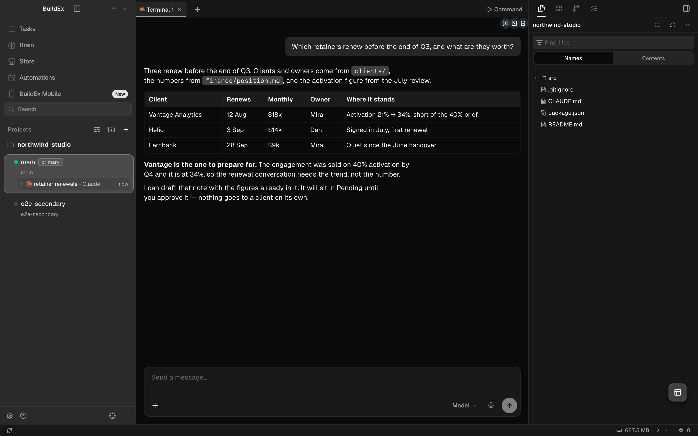
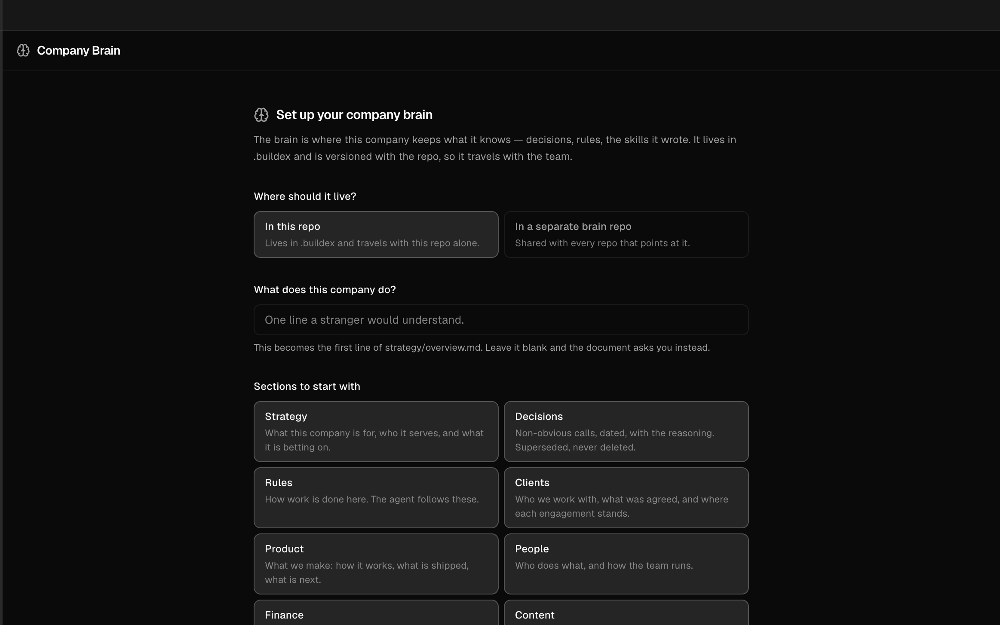
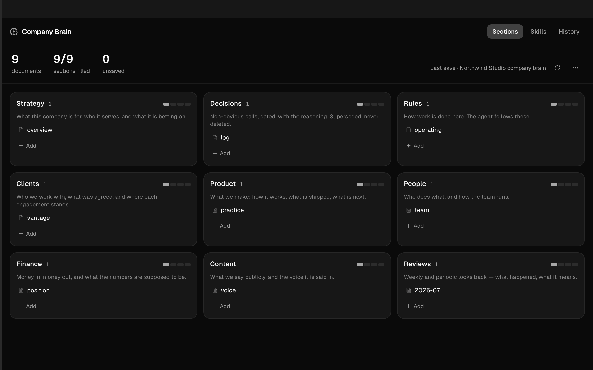
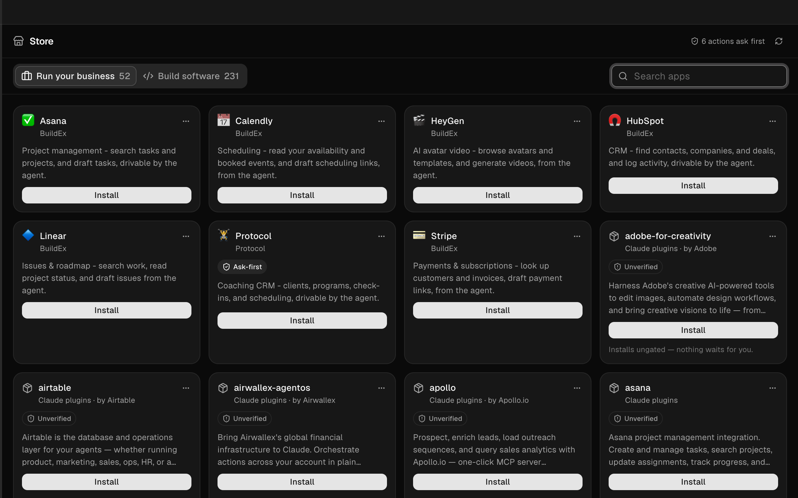

<h1 align="center">
   BuildEx
</h1>

<p align="center">
  <a href="https://github.com/stablyai/orca"></a>
  
  
  
</p>

<p align="center">
  <strong>Run your company on a coding agent, git, and your own tools — on your machine.</strong><br/>
  A git-backed brain of plain markdown that holds everything your company knows,
  and your own agent put to work on it.
</p>

> ### Built on [Orca](https://github.com/stablyai/orca)
>
> BuildEx is a **fork of [stablyai/orca](https://github.com/stablyai/orca)**, and nearly everything
> under this repo is Orca's work, not ours. The worktree orchestration, the terminals, the diff
> review, the SSH remotes, the editor, the mobile companion, the support for 25+ CLI agents — all of
> it is theirs, and all of it still works here. BuildEx adds four surfaces on top and changes almost
> nothing else.
>
> If you want the coding agent orchestrator itself, **go get [Orca](https://onorca.dev/download)** —
> it is excellent, it ships daily, and you should star it. BuildEx is only interesting if you want
> the company-brain layer described below. Our thanks to the Orca team and its
> [contributors](https://github.com/stablyai/orca/graphs/contributors) for building the hard part in
> the open under MIT.

> **Status: early.** Signed and notarized macOS builds ship on
> [releases](https://github.com/dejankeri/buildex/releases/latest) for both Apple Silicon
> (`buildex-macos-arm64.dmg`) and Intel (`buildex-macos-x64.dmg`); Linux and Windows still run from
> source (see [Run it](#run-it)). Read [the caveat](#running-alongside-orca) before running this
> next to your daily Orca.

<p align="center">
  
</p>

<p align="center">
  <em>Ask in plain English. The answer comes back from your own files, and the outward step waits for you.</em>
</p>

---

## What it is

Most "AI for work" tools are a chat box in someone else's cloud. BuildEx is the opposite:

- **Your files stay on your machine.** The brain is plain markdown under `.buildex/` in git repos you control.
- **Your own agent does the work.** BuildEx drives *your* signed-in agent — it never sees your keys, never proxies a model, never resells tokens.
- **Git is the database.** Every change is a commit. Full history, full undo, nothing hidden.
- **You approve the big moves.** Reading, editing, searching, shell and web run uninterrupted; `rm -rf`, force-push and `reset --hard` wait for a person.
- **There is no sync service.** Your company repo is a git repo, so sync is `git push` — [and that is a deliberate decision](PROGRESS.md#phase-5-why-there-is-no-sync-code), not a missing feature.

Built for the operator who runs the company, not the engineer.

## What BuildEx adds to Orca

| Surface | What it does |
|---|---|
| **Company Brain** | A full-screen view over `.buildex/` — nine sections with coverage bars, the skills your company wrote and the ones its apps brought, and history of every save. Documents are written in place with the app's own markdown editor; YAML front matter is held back and restored byte for byte, so a skill's `name:` and `description:` survive editing. |
| **Store & Apps** | 11 capability packs ship inside the app (Slack, Stripe, Linear, Notion, HubSpot, Asana, Calendly, Canva, Intercom, HeyGen, Protocol), so a fresh repo has a full shelf on first run. Installing writes skill scaffolds into the repo and never overwrites an existing skill. A repo's own catalog overrides a shipped pack by id. |
| **Agent context** | Writes `.claude/company-context.md` and an `@`-import into `.claude/CLAUDE.md`, so the next session starts knowing the company. Refreshed automatically whenever the map can have changed — there is no button, because a context someone has to remember to refresh is a context that is usually wrong. |
| **The gate** | An allow/ask/deny preset written into the repo's `.claude/settings.json`, so the agent's own runtime enforces it. A company can override it in `.buildex/gate-preset.json`; a broken override falls back to the shipped preset rather than to no gates. |

<table>
  <tr>
    <td width="50%" valign="top">
      
      <p><strong>Setting one up is a choice.</strong> Pick where the brain lives — in this repo, or one of
      its own that every repo can share — and which sections you want. Nothing is written until you press
      the button.</p>
    </td>
    <td width="50%" valign="top">
      
      <p><strong>Then it fills up.</strong> Nine sections of plain markdown in a repo you own, each with a
      coverage bar — and every save is a commit you can walk back.</p>
    </td>
  </tr>
  <tr>
    <td width="50%" valign="top">
      
      <p><strong>A full shelf on first run.</strong> The Store reads the marketplaces your agent already
      knows about, so what you see is what it can actually reach. Each pack says what it will ask you
      before it acts.</p>
    </td>
    <td width="50%" valign="top">
      <p><em>The company in these screenshots is invented — a fictional design studio, so no real company
      data is on display. Everything else is the app as it ships. They are captured from a real launch by
      <code>tests/e2e/buildex-marketing-capture.spec.ts</code>; regenerate them with
      <code>BUILDEX_CAPTURE=1</code>.</em></p>
    </td>
  </tr>
</table>

Two things the design insists on: **setting up a brain is a choice** — a repo with no brain is offered
setup rather than given one, and nothing is written until you pick your sections and press the button.
And **removing a brain cannot lose one** — the removal is committed when git holds the brain, and a
copy goes to `~/.buildex-backups/` when anything is uncommitted or there is no git.

The context feed and the gate are Claude Code-specific today, since they write `.claude/`. Every
other agent Orca supports still runs; it just does not get the company context automatically.

## Automations: businesses run while you sleep

This is Orca's own scheduler — cron and RRULE cadences, a fresh worktree per run when you want
one, run history, and a mobile companion that hears about the same sessions everything else does.
BuildEx built none of it. What BuildEx added is the company: **every** automation's workspace gets
the brain and the gate written before its startup agent's first message reads `.claude/`, same as a
session you start by hand ([how](BUILDEX-PATCHES.md#brain-packs-context--phases-2-4)) — a **New run**
worktree as it is created, an existing **Worktree** at dispatch. Both are bounded; see the
**Workspace** bullet below for what happens when the scan runs long.

**Open it:** the **Automations** button in the sidebar, then the **+** (*Add automation*). Fill in:

- **Project** — the repo, and **Workspace** — run in an existing **Worktree** (the default), or
  **New run**. Both load the company: **New run** creates a fresh worktree from a branch for that
  run and gets its context as it is created; **Worktree** reuses a worktree you already have open
  and gets its context refreshed at dispatch, before the agent starts. Either way the scan is
  bounded at 10 seconds, so a slow or wedged git degrades to the agent starting on whatever
  `.claude/company-context.md` was already there — stale, or absent if nothing has written one —
  rather than the run waiting on it or not happening. That expiry is logged only to the console,
  so it is invisible in the run's history. A **Worktree** run on an **SSH** host is the exception:
  its context is not written from here at all (see the gap below).
- **Schedule** — a cadence (**Hourly**, **Daily**, **Weekdays**, **Weekly**, or **Custom cron**
  for anything an RRULE preset can't say), a day/time, and a missed-run grace window for when
  Orca wasn't running at the scheduled moment.
- **Agent** and **Session** — which CLI agent runs it, and whether each run starts fresh or
  resumes the previous live session.
- Optionally a **precheck** command that has to pass before the run dispatches, and an *Advanced*
  toggle to run the project's normal setup on a freshly created workspace.

A run that can't proceed unattended — an SSH host it can't reach, or one that would need
interactive credentials — is recorded as **skipped**, with why, in that automation's run history
(**Run · Workspace · Spend · Tokens · Status**) rather than hanging or failing silently. **One
honest gap:** gating currently lands when a worktree is *created*, when an automation dispatches
into one, or when a BuildEx surface touches it; a worktree on an SSH host is not yet gated at
*activation* the way a local one is — and an SSH automation gets neither gate nor context here
([tracked here](PROGRESS.md#the-gate-what-is-done-and-what-is-not)) — schedule SSH automations
knowing that.

**Three rhythms worth starting with**, one per business, each a prompt against the section it
serves:

| Rhythm | Schedule | Reads / writes | Seeded in the Brain |
|---|---|---|---|
| Weekly review | Weekly | `reviews/`, `decisions/log.md`, `strategy/overview.md` | `reviews/weekly-review.md` |
| Engagement triage | Weekly | `clients/` | `clients/triage.md` |
| Metrics pull | Weekly, or Custom cron for a monthly close | `finance/` | `finance/metrics.md` |

Each of those Brain documents ships with its automation's exact prompt, ready to paste into the
**Prompt** field — set up the Brain's `reviews`, `clients` and `finance` sections and they're
there. Nothing runs until you schedule it.

## What works today (honestly)

| Works now | Not yet |
|---|---|
| Everything Orca does — worktrees, terminals, diffs, agents, SSH | Linux and Windows downloads (both run from source today) |
| The Brain: nine sections over `.buildex/`, edited in place | Inline approval cards and the activity ledger ([why](PROGRESS.md#the-gate-what-is-done-and-what-is-not)) |
| The Store on first run, with 11 packs shipped in the app | Pack MCP faces — parsed and carried, but installing does not write `.mcp.json` yet |
| Auto-fed company context, refreshed without a button | Gate applied on worktree activation (today it applies when a BuildEx surface first touches a repo) |
| The gate preset, enforced by the agent runtime | Any hosted sync — by decision, not by omission |
| Automations load the company brain and gate before their first message, in both workspace modes | Automations on an SSH host — nothing writes their context or gate from here, and SSH worktrees aren't gated at activation at all ([known gap](PROGRESS.md#the-gate-what-is-done-and-what-is-not)) |

## Run it

**Prerequisites:** Node 24, pnpm 10.24, git, and a CLI agent signed in (BuildEx drives your own; it
does not include or resell one).

```sh
git clone https://github.com/dejankeri/buildex.git
cd buildex
corepack pnpm@10.24.0 install
corepack pnpm@10.24.0 run dev
```

### Running alongside Orca

Orca installs its managed hooks to `~/.orca/agent-hooks/` and `~/.claude/settings.json` — both
global, both shared with the Orca you already run. Two instances arbitrate ownership with a lock so
nothing corrupts, but whichever holds it receives the hook traffic. Running this fork beside your
daily Orca can therefore take hook telemetry away from it. This is the open decision blocking inline
approval cards; see [`PROGRESS.md`](PROGRESS.md#the-gate-what-is-done-and-what-is-not).

## For contributors

Read these three before touching anything:

| Doc | What |
|---|---|
| [`BUILDEX-PATCHES.md`](BUILDEX-PATCHES.md) | Every line this fork changes in an upstream-owned file, and the rebase procedure. **The rule: BuildEx code lives in new files; an upstream file may only gain a registration.** That is what keeps rebases clean. |
| [`PROGRESS.md`](PROGRESS.md) | Phase status, what is real, what is not, and the decisions behind both. |
| [`AGENTS.md`](AGENTS.md) | The operating contract — design system, cross-platform rules, git compatibility floors. |

Rebase against upstream **weekly**:

```sh
git fetch upstream && git rebase upstream/main
```

At ~20 touch points of 1-3 lines each that is a ten-minute job; let it slide a month and the renderer
will have moved underneath you. Note that upstream main is not green — gate on *no new failures*,
never *all green*.

## License

[MIT](LICENSE), inherited from Orca. The `LICENSE` file keeps its original
**Copyright © 2026 Lovecast Inc.** notice unchanged, because the overwhelming majority of this
codebase is theirs. BuildEx's own additions are MIT on the same terms.

Orca's Windows code signing is sponsored by [SignPath.io](https://signpath.io) with a certificate
from the [SignPath Foundation](https://signpath.org). That sponsorship covers Orca, **not** this
fork — BuildEx needs its own Apple Developer ID and Windows certificate before it can ship
installers.
